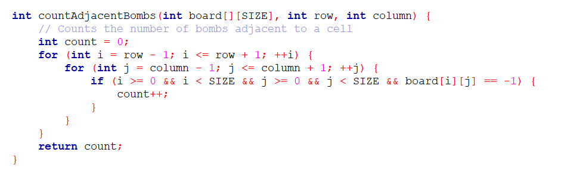
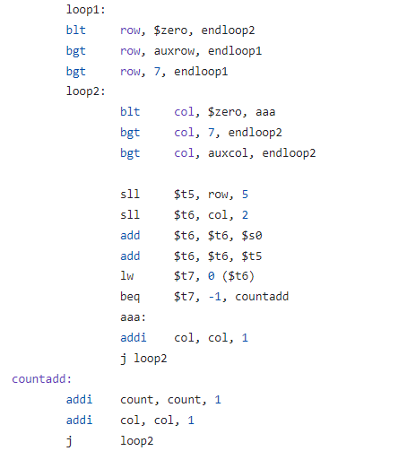
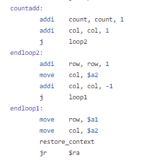
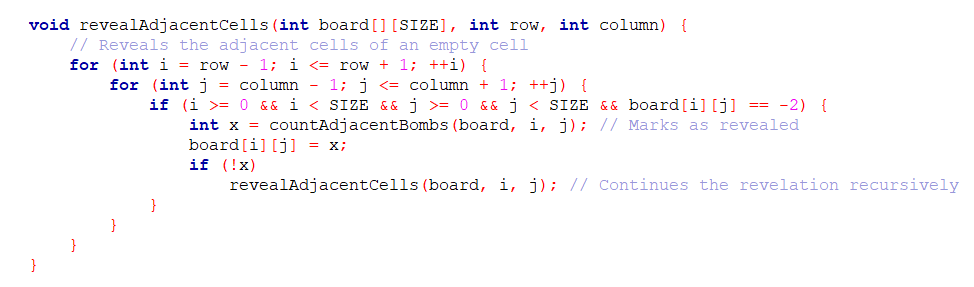
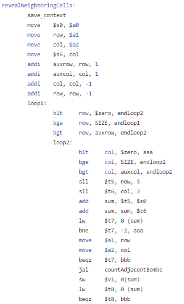
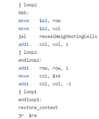

# minesweeper-in-MIPS
## ENTREGA TRABALHO DE ARQUITETURA E ORGANIZAÇÃO DE COMPUTADORES
Trabalho realizado pela dupla Manuela Menezes e Thiago Nerton.
Este README fornece informações sobre a atribuição, como configurar e executar o projeto, e detalhes adicionais.

## Sumário
- [countAdjacentBombs](#countAdjacentBombs)
- [revealAdjacentCells](#revealAdjacentCells)
- [Play](#Play)
- [checkVictory](#checkVictory)
- [Contribuições](#contribuições)
- [Licença](#licença)

### countAdjacentBombs
A função countAdjacentBombs é responsável pela contagem das bombas adjacentes à
posição escolhida no tabuleiro, permitindo ao jogador tomar decisões estratégicas
sobre onde fazer movimentos seguros baseado na quantidade de bombas ao redor de
uma célula específica.

As funções utilizam loops para iterar as células vizinhas tanto em C quanto em
assembly, contando com loops aninhados para percorrer tanto as linhas quanto as
colunas da matriz. O endereço da célula atual no tabuleiro é calculado e comparado a -1
(valor que indica a presença de uma bomba) e, caso as condições definidas sejam
satisfeitas, a variável ‘count’ é incrementada.

  
No código em assembly, o ‘endloop2’ incrementa a variável ‘row’, reseta a ‘column’, e
retorna para o ‘loop1’. Após toda a iteração ser completa, a função retorna a variável
‘count’. O mesmo é feito na função em C, porém de forma mais abstrata.

### revealAdjacentCells
A função revealAdjacentCells é responsável por expor as áreas vizinhas a uma célula
vazia no tabuleiro do jogo, permitindo uma revelação em cadeia até que células com
valores diferentes de -2 (indicando células não reveladas) sejam encontradas.

A estrutura da função é similar a da countAdjacentBombs, sendo a maior diferença
entre ambas a recursividade utilizada pela revealAdjacentCells para revelar as
células vazias de uma determinada área.

Após checar que uma determinada célula é vazia, a função countAdjacentBombs é
chamada e, caso o valor retornado seja igual a zero, a função revealAdjacentCells é
chamada para continuar o processo recursivamente.

### Play
