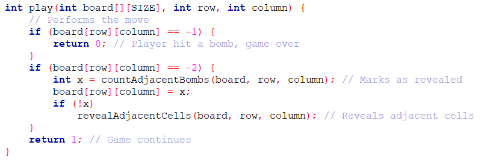
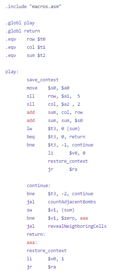
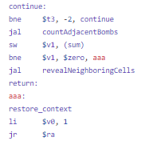
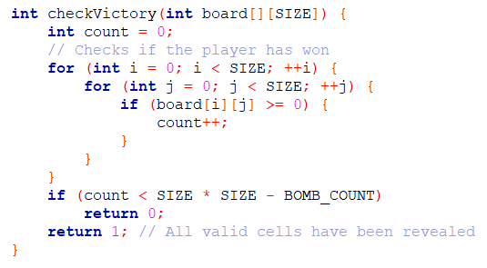
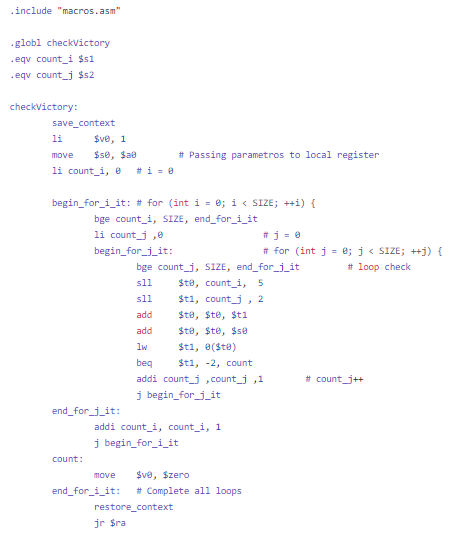

# minesweeper-in-MIPS
## ENTREGA TRABALHO DE ARQUITETURA E ORGANIZAÇÃO DE COMPUTADORES
Trabalho realizado pela dupla Manuela Menezes e Thiago Nerton.
Este README fornece informações sobre a atribuição, como configurar e executar o projeto, e detalhes adicionais.

## Sumário
- [countAdjacentBombs](#countAdjacentBombs)
- [revealAdjacentCells](#revealAdjacentCells)
- [Play](#Play)
- [checkVictory](#checkVictory)
- [Contribuições](#contribuições)
- [Licença](#licença)

### countAdjacentBombs
A função countAdjacentBombs é responsável pela contagem das bombas adjacentes à
posição escolhida no tabuleiro, permitindo ao jogador tomar decisões estratégicas
sobre onde fazer movimentos seguros baseado na quantidade de bombas ao redor de
uma célula específica.

As funções utilizam loops para iterar as células vizinhas tanto em C quanto em
assembly, contando com loops aninhados para percorrer tanto as linhas quanto as
colunas da matriz. O endereço da célula atual no tabuleiro é calculado e comparado a -1
(valor que indica a presença de uma bomba) e, caso as condições definidas sejam
satisfeitas, a variável ‘count’ é incrementada.

  
No código em assembly, o ‘endloop2’ incrementa a variável ‘row’, reseta a ‘column’, e
retorna para o ‘loop1’. Após toda a iteração ser completa, a função retorna a variável
‘count’. O mesmo é feito na função em C, porém de forma mais abstrata.

### revealAdjacentCells
A função revealAdjacentCells é responsável por expor as áreas vizinhas a uma célula
vazia no tabuleiro do jogo, permitindo uma revelação em cadeia até que células com
valores diferentes de -2 (indicando células não reveladas) sejam encontradas.

A estrutura da função é similar a da countAdjacentBombs, sendo a maior diferença
entre ambas a recursividade utilizada pela revealAdjacentCells para revelar as
células vazias de uma determinada área.

Após checar que uma determinada célula é vazia, a função countAdjacentBombs é
chamada e, caso o valor retornado seja igual a zero, a função revealAdjacentCells é
chamada para continuar o processo recursivamente.

### Play

A função play é responsável por processar as jogadas efetuadas. Ela verifica se o jogador
atingiu uma bomba e encerra o jogo se esse for o caso. Se a célula selecionada não for
uma bomba, o jogo é continuado normalmente.

Ambas as versões inicializam a função utilizando a matriz do tabuleiro e as
coordenadas definidas pelo jogador.

A função chama a coundAdjacentBombs para revelar a quantidade de bombas ao redor
da célula selecionada e, caso a quantidade seja zero, a revealAdjacentCells é utilizada
para expor as células vazias ao redor do local escolhido.

A função retorna 1 caso nenhuma bomba tenha sido atingida, indicando que o jogo deve
ser continuado. Caso contrário, a mesma retorna o valor 0, indicando o fim do jogo.

### checkVictory

A função checkVictory verifica se o jogador venceu o jogo contando as células
não-bomba reveladas, e retorna 1 se o jogador vencer e 0 caso contrário.

Ambas as versões validam a posição do tabuleiro e incrementam a variável ‘count’ caso
as condições sejam satisfeitas.

Após contar o número de células válidas, o código checa se o valor é menor do que a
quantidade total de células menos a quantidade de bombas. Caso seja, a função retorna
0, indicando que o jogo não está terminado. Caso contrário, a mesma retorna 1 e o jogo é
vencido.
